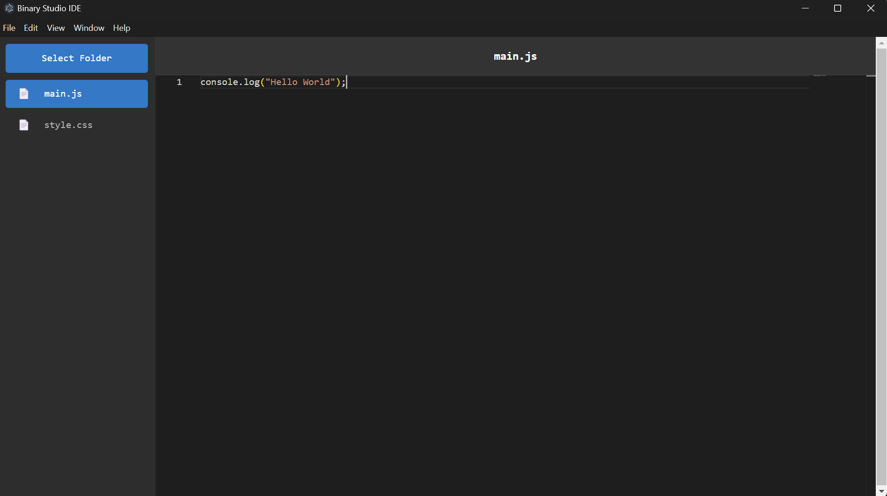

# Binary Studio IDE - Open Source (Code - OSS)

Welcome to **Binary Studio IDE**, an open-source code editor based on [Visual Studio Code](https://code.visualstudio.com/). This IDE is designed to offer a fast, powerful, and customizable development environment for various programming languages.



## Features

- **Fast and Lightweight**: Start coding with minimal overhead and fast startup time.
- **Extensible**: Add any number of extensions to enhance functionality.
- **Integrated Terminal**: Quickly run commands and scripts within the IDE.
- **Rich Debugging**: Debug code across different languages and environments with breakpoints, step-through, and variable inspection.
- **Git Integration**: Track code changes and manage repositories seamlessly with built-in Git support.
- **Syntax Highlighting**: Supports numerous programming languages for smooth coding experiences.
- **Custom Themes**: Choose from multiple themes or create your own.

## Installation

### Prerequisites

- **Node.js** (Recommended version: `v14.x` or above)
- **Git**

### Quick Setup

1. Clone the repository:

   ```bash
   git clone https://github.com/BinaryStudioOrg/BSIde.git
   ```

2. Navigate to the project directory:

   ```bash
   cd BSIde
   ```

3. Install dependencies:

   ```bash
   npm install
   ```

4. Run the IDE:
   ```bash
   npm run dev
   ```

For more detailed setup, refer to the [wiki](https://github.com/BinaryStudioOrg/BSIde/wiki) or our [documentation](https://docs.binarystudio.org/ide).

## Contributing

We welcome contributions to **Binary Studio IDE**! If you have an idea for an enhancement or bug fix, please open an issue or submit a pull request.

### How to contribute:

1. Fork the repository.
2. Create a new branch for your feature/bug fix.
3. Make your changes.
4. Run tests (if applicable).
5. Submit a pull request describing your changes.

## Reporting Issues

If you encounter any bugs or have feature requests, please let us know! You can open an issue on GitHub by visiting the following links:

- [Feature Requests](https://github.com/BinaryStudioOrg/BSIde/issues?q=is%3Aopen+is%3Aissue+label%3Afeature-request+sort%3Areactions-%2B1-desc)
- [Bug Reports](https://github.com/BinaryStudioOrg/BSIde/issues?utf8=%E2%9C%93&q=is%3Aissue+is%3Aopen+label%3Abug)

For urgent matters, you can join our live chat on Gitter:

- [Gitter Chat](https://gitter.im/BinaryStudioOrg/BSIde)

## License

This project is licensed under the MIT License - see the [LICENSE](https://github.com/BinaryStudioOrg/BSIde/blob/main/LICENSE) file for details.
